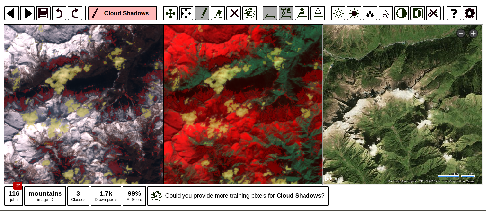

**Work in progress.**

# IRIS - Intelligence foR Image Segmentation1
1Yes, it is a <a href="https://en.wikipedia.org/wiki/Backronym">backronym</a>.

Tool for manual image segmentation and classification of satellite imagery (or images in general). It was designed to accelerate the creation of machine learning training datasets for Earth Observation. This application is a flask app which can be run locally. Special highlights:
* Support by AI (gradient boosted decision tree) when doing image segmentation
* Multiple and configurable views for multispectral imagery
* Simple setup with pip and one configuration file
* Platform independent app (runs on Linux, Windows and Mac OS)
* Multi-user support: work in a team on your dataset and merge the results

## Installation
Since IRIS is written in python, you will need a python 3.7 environment to use this app.
Go to your preferenced installation folder via your console and clone this repository by running:

`git clone https://github.com/ESA-PhiLab/iris.git`.

Enter the iris directory with

`cd iris`

and install the app with pip

`pip install .`

This should install all necessary python packages automatically.

## Usage

You can start IRIS in two different modes:
1) **label:** This will open a local browser application which helps you to perform manual segmentation of the images in your project. You will need a project file for this. Have a look at the demo folder or at the documentation below in this document for inspiration. After setting up the project file, start IRIS like this: `iris label PROJECT_FILE` and open `http://localhost:5000` with your browser (chrome or firefox).

2) **demo:** Keen on trying out iris without any setup? Try `iris demo` and have fun with the demo by open `http://localhost:5000` with your browser (chrome or firefox).

## Documentation

### Label interface

### Project file
Before you can use IRIS, you have to provide a project file for your project (must be in yaml or json format). See [here](demo/cloud-segmentation.json) for an example.

Please have a look at the different options for the configurations in the [documentation](docs/config.md).

### Project structure

Coming soon.
