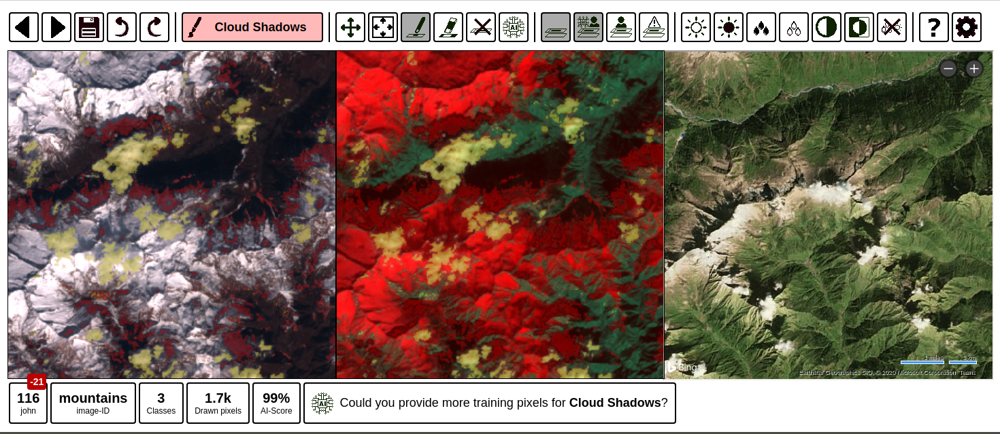

# IRIS - Intelligently Reinforced Image Segmentation<sup>1</sup>
<sup>1</sup>Yes, it is a <a href="https://en.wikipedia.org/wiki/Backronym">backronym</a>.



Tool for manual image segmentation of satellite imagery. It was designed to accelerate the creation of machine learning training datasets for Earth Observation. IRIS is a static web page: everything runs in the browser, so it can be published on GitHub Pages or any web host, with no server to run. Special highlights:
* Support by AI (gradient boosted decision trees, trained in the browser) when doing image segmentation
* Multiple and configurable views for multispectral imagery, shown at their place on a map (MapLibre)
* Images read straight from Cloud Optimized GeoTIFFs (COG), wherever they are served: next to the page, on the Hugging Face Hub, on S3, ...
* Masks kept in the browser, or on the Hugging Face Hub for a team
* Accounts in an encrypted `credentials.json`, published with the page
* One configuration file per project ([guide](docs/config.md))

## Quick start

IRIS needs [Node.js](https://nodejs.org/) 22.22.2 or higher.

```bash
git clone https://github.com/ESA-PhiLab/iris
cd iris
npm install
npm run dev
```

Then open http://localhost:3000: IRIS opens the demo project in [public/demo](public/demo). It is recommended to use a keyboard and mouse with scrollwheel for IRIS; the help (`?` in the top bar) lists the shortcuts.

## How a site is put together

The page reads `iris.json` next to it, which says where everything is:

```json
{
  "project": "demo/cloud-segmentation.json",
  "labels": "hf://buckets/<owner>/<name>",
  "credentials": "credentials.json",
  "guests": true
}
```

| Field | Meaning |
| --- | --- |
| `project` | The project file ([guide](docs/config.md)), a path relative to the page or a Hugging Face path. Required. |
| `labels` | Where the masks of the team go: a bucket `hf://buckets/<owner>/<name>` (recommended) or a dataset `hf://datasets/<owner>/<name>`. Without it, every user keeps their masks in their own browser. |
| `credentials` | The accounts, see [Accounts](#accounts). Without it there are no accounts: whoever opens the page is the user `local`, an admin. |
| `guests` | Whether people can enter without an account (default `true`). Their masks stay in their browser. |

The paths in the project file are relative to the project file, so a project and its images can live together in a folder or a dataset. The ids of the images are listed in `images.json` next to the project file, or in the project file itself (see the [guide](docs/config.md#images)).

The `iris.json` in [public](public) is published with the site. Edit it to point to your own project.

### Images

IRIS only reads Cloud Optimized GeoTIFFs: tiled, with a CRS, so that each image can be shown at its place on the map. You can create one with GDAL:

```bash
gdal_translate -of COG input.tif image.tif
```

The browser uses HTTP range requests to read the COGs, so the files must be served by a host that answers them (GitHub Pages, the Hugging Face Hub and S3 do) and, when they are on another site than the page, that allows it with CORS. IRIS currently decodes every band of the current image into browser memory. Large scenes should therefore be tiled or downsampled to a size appropriate for the users' devices.

### Data on the Hugging Face Hub

The project, the images and the masks can live on the [Hugging Face Hub](https://huggingface.co), written as paths:

```
hf://datasets/<owner>/<name>[@<revision>]/<path>
hf://buckets/<owner>/<name>/<path>
```

For example `"project": "hf://datasets/my-org/clouds/project.json"`. Public datasets are read by anyone; private ones need the token of the user who signed in. The masks are written with the token of the user, as files laid out per image:

```
segmentation/<image>/<user>_mask.tif   the mask: a COG of the mask area with two bands,
                                       the class of each pixel and whether the user drew it
segmentation/<image>/<user>.json       the notes about the image and when the mask was saved
```

In a bucket each save simply replaces the files. In a dataset each save is a commit. Before an upload starts, IRIS keeps the files in a durable browser outbox; a failed upload can therefore be retried after reloading the page.

### Accounts

`credentials.json` holds one entry per user, encrypted with a key derived from their name and password: the file shows no names and can be published with the site. Unlocking an entry gives the role of the user (`admin` or `annotator`) and their Hugging Face token, kept for the session of the browser tab.

Add and remove users with:

```bash
npm run credentials -- add <user> --role admin --file public/credentials.json
npm run credentials -- remove <user> --file public/credentials.json
```

The script asks for the password (or reads `IRIS_PASSWORD`) and reads the user's Hugging Face token from `HF_TOKEN`. Anyone who knows a password can read the token in that entry, so give each user a [fine-grained token](https://huggingface.co/docs/hub/security-tokens) limited to the project's dataset and bucket, and long random passwords (at least 16 characters).

Accounts are intended for a trusted team. Because IRIS has no server, roles control the interface but cannot enforce authorization: a user can access their own decrypted token and perform anything that token permits. Tokens must therefore grant only the minimum repositories and operations that user needs. If users must be isolated from one another, place an authenticated service in front of the storage instead of publishing tokens in `credentials.json`.

### Masks, review and export

Users save their masks with the save button or by going to another image. From their profile they can download all their masks as files. The export button makes a GeoTIFF of the current image with its mask.

Admins have a Review button: who annotated each image, their notes, how well their masks agree, and the GeoTIFFs of the masks merged by majority. Admins also edit the project in the preferences: when the project file is in a dataset and their token can write to it, it is saved there; otherwise the edited file is downloaded, to replace the old one with.

## Publishing on GitHub Pages

The workflow [pages.yml](.github/workflows/pages.yml) builds the site and publishes it on every push to `master` (or when run by hand). In the settings of the repository, under Pages, choose GitHub Actions as the source. The site is then `public/` (with `iris.json`, the demo and any `credentials.json`) plus the page built by Vite.

To publish it elsewhere, build it and copy `dist/` to any web host:

```bash
npm run build
```

## Development

```bash
npm run dev          # Vite dev server on port 3000
npm test             # the tests (Vitest)
npm run typecheck    # TypeScript type checking
npm run build        # the site in dist/
npm run preview      # serve dist/
```

The code is in [src](src): the raster engine that reads the COGs and renders the views in a web worker ([src/raster](src/raster)), the AI ([src/ai](src/ai)), the editor ([src/segmentation](src/segmentation), [src/stores](src/stores)), where the project and the masks are read and written ([src/services](src/services)) and the interface ([src/components](src/components)).

**Visit the official iris Github page: https://github.com/ESA-PhiLab/iris**
